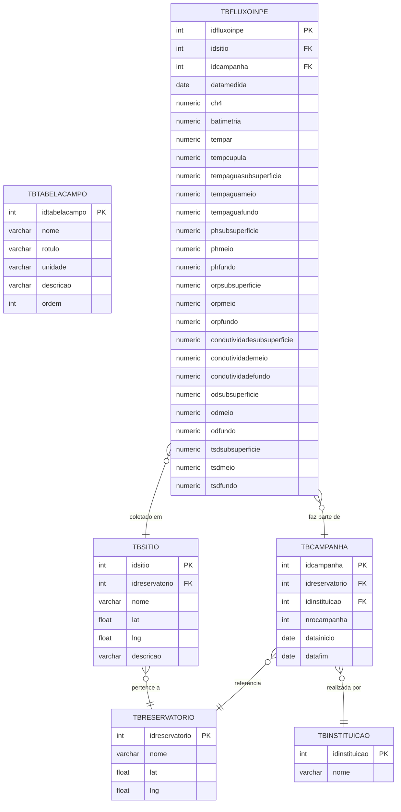
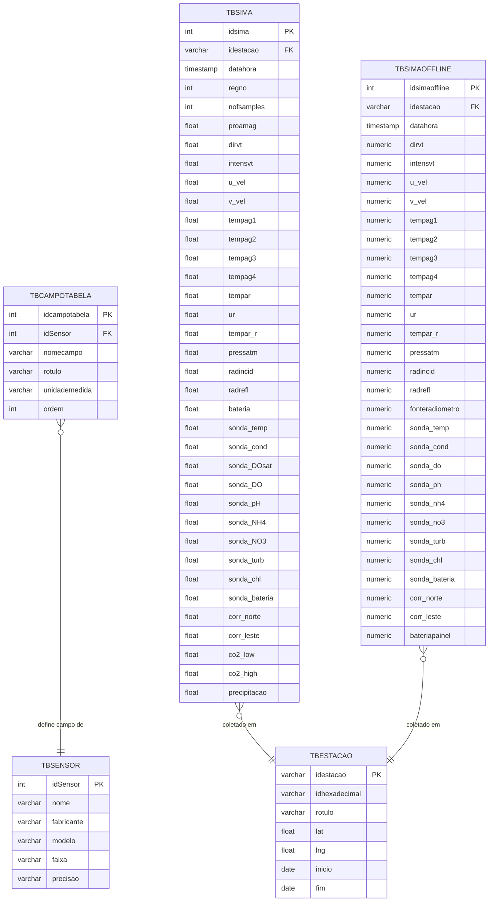

## 📊 Projeto ABP – Repositório de Dados Limnológicos

Este projeto integra múltiplos bancos de dados PostgreSQL, uma API em Node.js/Express escrita em TypeScript, e um front-end em React (Vite + TypeScript + styled-components).
O objetivo é oferecer uma aplicação organizada, containerizada e com boas práticas de desenvolvimento (linting, formatação, CI/CD e tema global).


### ▶️ Subindo os Containers

1. Clonar o repositório e instalar dependências:
```bash
git clone https://github.com/arleysouza/abp-2dsm-2025-2.git app
cd app
```

2. Como o projeto roda com bind mount no container, então será necessário instalar as dependências nas pasta `/front` e `/server`:
```bash
cd server
npm i
cd ..
cd front
npm i
```
Certifique-se de que exista a pasta `node_modules` nas pastas `front` e `/server`.

3. Para inicializar todo o ambiente (bancos de dados, servidor e front-end):
```bash
docker compose -f docker-compose.dev.yml up --build -d
```
- A flag `--build` força a reconstrução das imagens (aplica alterações recentes).
- Certifique-se de executar o comando na raiz do projeto, ou seja, no diretório onde está localizado o arquivo `docker-compose.dev.yml`. Caso contrário, o Docker não encontrará as definições dos serviços.
- Para parar os containers:
```bash
docker compose -f docker-compose.dev.yml down
```

---

### 📂 Estrutura de Pastas

A organização do projeto segue uma separação clara entre bancos de dados (scripts e dados), servidor (código da aplicação) e configurações gerais.

```bash
app/
├── balcar-campanha/            
│   ├── csv/                       # Arquivos de dados (CSV) carregados nas tabelas
│   ├── copy-table.sql             # Script SQL para importar os arquivos CSV para o banco
│   ├── create-table.sql           # Script SQL para criar a estrutura das tabelas
│   └── balcar-campanha-modelo.xml # Modelo conceitual do banco, visualizável no DBDesigner
│  
├── furnas-campanha/
│   ├── csv/                       # Arquivos de dados (CSV) carregados nas tabelas
│   ├── copy-table.sql             # Script SQL para importar os arquivos CSV para o banco
│   ├── create-table.sql           # Script SQL para criar a estrutura das tabelas
│   └── furnas-campanha-modelo.xml # Modelo conceitual do banco, visualizável no DBDesigner
│   
├── sima/
│   ├── csv/                       # Arquivos de dados (CSV) específicos do SIMA
│   ├── copy-table.sql             # Script SQL para importação dos CSV
│   ├── create-table.sql           # Script SQL para criação das tabelas
│   └── sima-modelo.xml            # Modelo conceitual do banco SIMA (para DBDesigner)
│ 
├── server/
│   ├── src/                       # Código-fonte da aplicação
│   │   ├── configs/               # Configurações, como conexão com banco de dados
│   │   │   └── db.ts
│   │   ├── controllers/           # Lógica de controle (recebem requisições, chamam serviços)
│   │   ├── routes/                # Definição das rotas da API
│   │   └── index.ts               # Arquivo principal que inicializa o servidor
│   ├── .env                       # Variáveis de ambiente da aplicação
│   ├── Dockerfile                 # Receita para construção da imagem Docker do servidor
│   ├── package.json               # Dependências e scripts NPM
│   ├── package-lock.json          # Controle de versões exatas das dependências
│   ├── tsconfig.json              # Configurações do compilador TypeScript
│   ├── tsconfig.eslint.json       # Regras de análise estática específicas para ESLint
│   ├── eslint.config.mjs          # Configuração de qualidade de código (ESLint)
│   ├── .prettierrc                # Configuração de formatação automática (Prettier)
│   └── .prettierignore            # Arquivos/pastas ignorados pelo Prettier
│
├── front/                        # Front-end React + Vite + styled-components
│   ├── src/
│   │   ├── api/                  # Consumo da API (axios)
│   │   ├── components/           # Componentes reutilizáveis
│   │   ├── hooks/                
│   │   ├── pages/                # Páginas (ex.: SimaPage)
│   │   ├── styles/               # GlobalStyle + ThemeProvider
│   │   └── types/               
│   ├── Dockerfile
│   ├── vite.config.ts
│   ├── package.json
│   └── tsconfig.json
│
├── .github/workflows/ci.yml       # Pipeline de Integração Contínua
├── .gitignore                     # Define arquivos e pastas que não devem ir para o Git
└── docker-compose.dev.yml         # Definições dos serviços Docker para ambiente de desenvolvimento
  
```

---

### 🔑 Principais Tecnologias e Configurações

**Back-end (`server/`)**

- Node.js + Express + TypeScript.
- Estrutura em camadas (configs, controllers, routes).
- Conexão com múltiplos bancos via `pg.Pool`.
- Middlewares: JSON parser, erro global, CORS configurado (apenas GET).
- ESLint + Prettier para padronização de código.
- Dockerfile com hot reload (ts-node-dev).

**Front-end (`front/`)**

- React + Vite + TypeScript.
- styled-components com `ThemeProvider` global (cores, tipografia, espaçamento).
- GlobalStyle para reset de estilos.
- Barra Brasil + Menu responsivo com hambúrguer.
- Estrutura organizada (`api/`, `components/`, `pages/`, `styles/`).
* Axios configurado com `VITE_SERVER_PORT`.

**Banco de Dados**

- PostgreSQL 17 (um container por domínio: furnas-campanha, sima, balcar-campanha).
- Scripts SQL para `CREATE TABLE` e `COPY FROM CSV`.
- Volumes persistentes para dados.
- Cada banco acessível em uma porta distinta (5433, 5434, 5435).

**CI/CD**

- GitHub Actions (`.github/workflows/ci.yml`):
    - O projeto utiliza GitHub Actions para garantir qualidade de código e que a stack Docker esteja sempre saudável.
    - O pipeline roda automaticamente em **push** e **pull requests** para a branch `main`.
- Estrutura de Jobs: `server-ci`, `front-ci` e `docker-ci`.

---

### B🚀 Como rodar o projeto localmente (sem Docker)

**Back-end**
```bash
cd server
npm install
npm run dev
```
API disponível em: http://localhost:3001

**Front-end**
```bash
cd front
npm install
npm run dev
```
App disponível em: http://localhost:3002


--- 

### 🌐 Acessando a Aplicação

- Front-end (React): http://localhost:3002

- Back-end (API Node): http://localhost:3001
    - Exemplo: http://localhost:3001/sima/sima/all?page=1&limit=20

---

### 🛠️ Boas práticas aplicadas

- Separação clara de camadas (DB / API / Front).
- Containers independentes para cada banco.
- Hot reload para server e front em dev.
- ESLint + Prettier (garantindo padronização de código).
- CI no GitHub Actions.

---

### Bancos de dados

**Banco de dados `balcar-campanha`**


**Banco de dados `furnas-campanha`**

```mermaid
erDiagram
    TBINSTITUICAO {
        int idinstituicao PK
        varchar nome
    }

    TBRESERVATORIO {
        int idreservatorio PK
        varchar nome
        float lat
        float lng
    }

    TBCAMPANHA {
        int idcampanha PK
        int idinstituicao FK
        int idreservatorio FK
        int nroCampanha
        date datainicio
        date datafim
    }

    TBSITIO {
        int idsitio PK
        int idreservatorio FK
        varchar nome
        float lat
        float lng
        varchar descricao
    }

    TBTABELA {
        int idtabela PK
        int idinstituicao FK
        varchar nome
        varchar rotulo
        varchar excecao
        varchar sitio
        varchar campanha
    }

    TBCAMPOPORTABELA {
        int idcampoportabela PK
        int idtabela FK
        varchar nome
        varchar rotulo
        varchar unidade
        varchar descricao
        varchar principal
        int ordem
        varchar tipo
    }

    TBCAMPANHAPORTABELA {
        int idcampanha FK
        int idtabela FK
    }

    TBDADOSPRECIPITACAO {
        int iddadosprecipitacao PK
        int idreservatorio FK
        date datamedida
        float precipitacao
    }

    TBDADOSREPRESA {
        int iddadosrepresa PK
        int idreservatorio FK
        date datamedida
        float nivelReservatorio
        float volUtilReservatorio
    }

    %% Medidas científicas (todas seguem padrão: campanha + sítio)
    TBABIOTICOCOLUNA {
        int idabioticocoluna PK
        int idcampanha FK
        int idsitio FK
    }
    TBABIOTICOSUPERFICIE { int idabioticosuperficie PK }
    TBAGUAMATERIAORGANICASEDIMENTO { int idag PK }
    TBBIOTICOCOLUNA { int idbiotico PK }
    TBBIOTICOSUPERFICIE { int idbioticosuperficie PK }
    TBBOLHAS { int idbolhas PK }
    TBCAMARASOLO { int idcamarasolo PK }
    TBCARBONO { int idcarbono PK }
    TBCONCENTRACAOGASAGUA { int idconcentracaoagua PK }
    TBCONCENTRACAOGASSEDIMENTO { int idconcentracaosed PK }
    TBDIFUSAO { int iddifusao PK }
    TBDUPLADESSORCAOAGUA { int iddupla PK }
    TBFLUXOBOLHASINPE { int idfluxobolhas PK }
    TBFLUXOCARBONO { int idfluxocarbono PK }
    TBFLUXODIFUSIVO { int idfluxodifusivo PK }
    TBFLUXODIFUSIVOINPE { int idfluxodifinpe PK }
    TBGASESEMBOLHAS { int idgases PK }
    TBHORIBA { int idhoriba PK }
    TBIONSNAAGUAINTERSTICIALDOSEDIMENTO { int idions PK }
    TBMEDIDACAMPOCOLUNA { int idmedcoluna PK }
    TBMEDIDACAMPOSUPERFICIE { int idmedsup PK }
    TBNUTRIENTESSEDIMENTO { int idnutrientes PK }
    TBPARAMETROSBIOLOGICOSFISICOSAGUA { int idparambio PK }
    TBPFQ { int idpfq PK }
    TBTC { int idtc PK }
    TBVARIAVEISFISICASQUIMICASDAAGUA { int idvariaveis PK }

    %% Relacionamentos principais
    TBCAMPANHA }o--|| TBINSTITUICAO : "realizada por"
    TBCAMPANHA }o--|| TBRESERVATORIO : "referencia"
    TBSITIO }o--|| TBRESERVATORIO : "pertence a"
    TBTABELA }o--|| TBINSTITUICAO : "definida por"
    TBCAMPOPORTABELA }o--|| TBTABELA : "define campo"
    TBCAMPANHAPORTABELA }o--|| TBCAMPANHA : "associa"
    TBCAMPANHAPORTABELA }o--|| TBTABELA : "associa"
    TBDADOSPRECIPITACAO }o--|| TBRESERVATORIO : "medido em"
    TBDADOSREPRESA }o--|| TBRESERVATORIO : "medido em"

    %% Padrão Campanha+Sitio
    TBABIOTICOCOLUNA }o--|| TBCAMPANHA : "coleta"
    TBABIOTICOCOLUNA }o--|| TBSITIO : "local"
    TBABIOTICOSUPERFICIE }o--|| TBCAMPANHA : "coleta"
    TBABIOTICOSUPERFICIE }o--|| TBSITIO : "local"
    TBAGUAMATERIAORGANICASEDIMENTO }o--|| TBCAMPANHA : "coleta"
    TBAGUAMATERIAORGANICASEDIMENTO }o--|| TBSITIO : "local"
    TBBIOTICOCOLUNA }o--|| TBCAMPANHA : "coleta"
    TBBIOTICOCOLUNA }o--|| TBSITIO : "local"
    TBBIOTICOSUPERFICIE }o--|| TBCAMPANHA : "coleta"
    TBBIOTICOSUPERFICIE }o--|| TBSITIO : "local"
    TBBOLHAS }o--|| TBCAMPANHA : "coleta"
    TBBOLHAS }o--|| TBSITIO : "local"
    TBCAMARASOLO }o--|| TBCAMPANHA : "coleta"
    TBCAMARASOLO }o--|| TBSITIO : "local"
    TBCARBONO }o--|| TBCAMPANHA : "coleta"
    TBCARBONO }o--|| TBSITIO : "local"
    TBCONCENTRACAOGASAGUA }o--|| TBCAMPANHA : "coleta"
    TBCONCENTRACAOGASAGUA }o--|| TBSITIO : "local"
    TBCONCENTRACAOGASSEDIMENTO }o--|| TBCAMPANHA : "coleta"
    TBCONCENTRACAOGASSEDIMENTO }o--|| TBSITIO : "local"
    TBDIFUSAO }o--|| TBCAMPANHA : "coleta"
    TBDIFUSAO }o--|| TBSITIO : "local"
    TBDUPLADESSORCAOAGUA }o--|| TBCAMPANHA : "coleta"
    TBDUPLADESSORCAOAGUA }o--|| TBSITIO : "local"
    TBFLUXOBOLHASINPE }o--|| TBCAMPANHA : "coleta"
    TBFLUXOBOLHASINPE }o--|| TBSITIO : "local"
    TBFLUXOCARBONO }o--|| TBCAMPANHA : "coleta"
    TBFLUXOCARBONO }o--|| TBSITIO : "local"
    TBFLUXODIFUSIVO }o--|| TBCAMPANHA : "coleta"
    TBFLUXODIFUSIVO }o--|| TBSITIO : "local"
    TBFLUXODIFUSIVOINPE }o--|| TBCAMPANHA : "coleta"
    TBFLUXODIFUSIVOINPE }o--|| TBSITIO : "local"
    TBGASESEMBOLHAS }o--|| TBCAMPANHA : "coleta"
    TBGASESEMBOLHAS }o--|| TBSITIO : "local"
    TBHORIBA }o--|| TBCAMPANHA : "coleta"
    TBHORIBA }o--|| TBSITIO : "local"
    TBIONSNAAGUAINTERSTICIALDOSEDIMENTO }o--|| TBCAMPANHA : "coleta"
    TBIONSNAAGUAINTERSTICIALDOSEDIMENTO }o--|| TBSITIO : "local"
    TBMEDIDACAMPOCOLUNA }o--|| TBCAMPANHA : "coleta"
    TBMEDIDACAMPOCOLUNA }o--|| TBSITIO : "local"
    TBMEDIDACAMPOSUPERFICIE }o--|| TBCAMPANHA : "coleta"
    TBMEDIDACAMPOSUPERFICIE }o--|| TBSITIO : "local"
    TBNUTRIENTESSEDIMENTO }o--|| TBCAMPANHA : "coleta"
    TBNUTRIENTESSEDIMENTO }o--|| TBSITIO : "local"
    TBPARAMETROSBIOLOGICOSFISICOSAGUA }o--|| TBCAMPANHA : "coleta"
    TBPARAMETROSBIOLOGICOSFISICOSAGUA }o--|| TBSITIO : "local"
    TBPFQ }o--|| TBCAMPANHA : "coleta"
    TBPFQ }o--|| TBSITIO : "local"
    TBTC }o--|| TBCAMPANHA : "coleta"
    TBTC }o--|| TBSITIO : "local"
    TBVARIAVEISFISICASQUIMICASDAAGUA }o--|| TBCAMPANHA : "coleta"
    TBVARIAVEISFISICASQUIMICASDAAGUA }o--|| TBSITIO : "local"
```


**Banco de dados `sima`**
